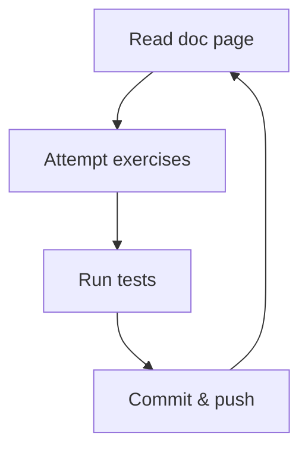

# Cash register

<p align="center">
  
</p>

Welcome to the cash register! This is a library of functions to be used in
point-of-sale systems around the country.

## Getting started

1. Make sure your machine is set up according to the instructions with

   - [bash](https://tech-docs.corndel.com/bash/)
   - [vscode](https://tech-docs.corndel.com/vscode/)
   - [git](https://tech-docs.corndel.com/git/)
   - [node & npm](https://tech-docs.corndel.com/js/installation.html)

1. Clone the repository (i.e. download it), so you have a copy on your machine.

1. Once cloned, open a terminal in the project folder, and run

   ```bash
   npm install
   ```

   to install dependencies.

## Deep dive

Before working on the functions, let's learn how to work with objects.



> [!NOTE]
>
> You can test the exercises using `npm run test:1a` and similar.

### Object properties

1. Read through [objects](https://tech-docs.corndel.com/js/objects.html) and
   [object tricks](https://tech-docs.corndel.com/js/object-tricks.html)

1. Solve, commit and push [exercise 1a](./exercises/1a.js)

1. Solve, commit and push [exercise 1b](./exercises/1b.js)

### Lists of objects

1. Read through
   [lists of objects](https://tech-docs.corndel.com/js/lists-of-objects.html)

1. Solve, commit and push [exercise 2a](./exercises/2a.js)

1. Solve, commit and push [exercise 2b](./exercises/2b.js)

### Object nesting

1. Read through
   [object nesting](https://tech-docs.corndel.com/js/object-nesting.html)

1. Solve, commit and push [exercise 3a](./exercises/3a.js)

1. Solve, commit and push [exercise 3b](./exercises/3b.js)

## Workshop

Head to `CONTRIBUTING.md` to find out how to contribute to this project!
